# social-net
A social networking application created via an API where users can create accounts that store information, share their thoughts, react to friends' thoughts, and add friends. This demonstrates calling third-party HTTP-based APIs using JavaScript frameworks and Object Document Mapping - an ORM for non-relational databases (NoSQL) such as MongoDB.

This application uses Express.js (via Node.js) to establish routes, a MongoDB database, and the Mongoose ODM. All seed data except for basic user info was created dynamically through Postman requests.


## User Story
```md
AS A social media startup
I WANT an API for my social network that uses a NoSQL database
SO THAT my website can handle large amounts of unstructured datav
```

## Table of Contents
* [Description: Social Network API (NoSQL)](#description-social-network-api-nosql)
* [Features](#features)
* [Installation](#installation)
* [Usage](#usage)
* [Built With](#built-with)
* [Walkthrough Video](#walk-through-video)

## Description: Social Network API (NoSQL)
In developing this application, I utilized Express.js and Node.js to make up the middle or application layer, and MongoDB (via Mongoose) to create the database layer, and Postman to dynamically add real data to the database. This application is focused on back-end functionality, so it will require installation of Node, Express, and a playground like Postman or Insomnia.

Social media technology has offered us greater convenience and connectivity. Staying connected with family and friends worldwide via email, FaceTime, etc. has never been so accessible. Along with this- quick access to information and research, online learning, job skills, content discovery, and opportunities for remote employment are all benefits of social media APIs. 

Social-Net allows users to dynamically create, delete, and update user information such as thoughts posted, reactions, friend lists, etc.

## Features
> This is a social network API that uses MongoDB, a NoSQL database, which allows applications to handle large amounts of unstructured data. MongoDB, a general purpose NoSQL, document database, uses documents to store data. MongoDB is very compatile with JavaScript because it stores data in objects called BSON (Binary JSON). A BSON looks and acts just like JSON, but is optimized for faster parsing. The key decision in designing data models for MongoDB applications revolves around the structure of documents and how the application represents relationships between data. MongoDB allows related data to be embedded within a single document. MongoDB also is also a great choice for heterogenous data, and scales easily.

This application holds two main collections of documents stored in the NoSQL database that reference each other, and together, form the `social-net` database. These collections are provided by embedded data models and normalized data models. Mongoose also facilitates data in virtuals, which are document properties that do not persist or get stored in the MongoDB database, they only exist logically as an additional field for a given model.


**The following chart outlines the document schema and modeling relationships of the socialNetDB in MongoDB**

| Database          | Collections           | Documents                 | Fields                | DBRefs     | References | Virtual |
|:-----------------:|:---------------------:|:-------------------------:|:---------------------:|:----------:|:----------:|:--------|
| social-net        | | | | | | |
|                   | users                 |                           |                       |            |                       | |
|                   |                       | User                      |                       |            |                       | |
|                   |                       |                           | username              |            |                       | |
|                   |                       |                           | email                 |            |                       | |
|                   |                       |                           | thoughts              | ObjectId   |  Thought model        | |
|                   |                       |                           | friends               | ObjectId   |  User model (self-reference)     | friendCount|
|                   | thoughts and reactions|                           |                       |            |                       | |
|                   |                       |  Thought                  |                       |            |                       | |
|                   |                       |                           |  thoughtText          |            |                       | |
|                   |                       |                           |  createdAt            |            |                       | |
|                   |                       |                           |  username             |            |                       | |
|                   |                       |                           |  reactions            | [reactions]| nested Reaction subdocuments| reactionCount |
|                   |                       | Reaction                  |                       |            |                       | | |
|                   |                       |                           | reactionId            | ObjectId   | Thought document      | | |
|                   |                       |                           | reactionBody          |            |                       | | |
|                   |                       |                           | username              |            |                       | | |
|                   |                       |                           | createdAt             |            |                       | | |

> When the command to invoke the application is entered, the Mongoose models are synced to the MongoDB database:

> API Routes

>> GET Routes

    GET all...

- users (/api/users)

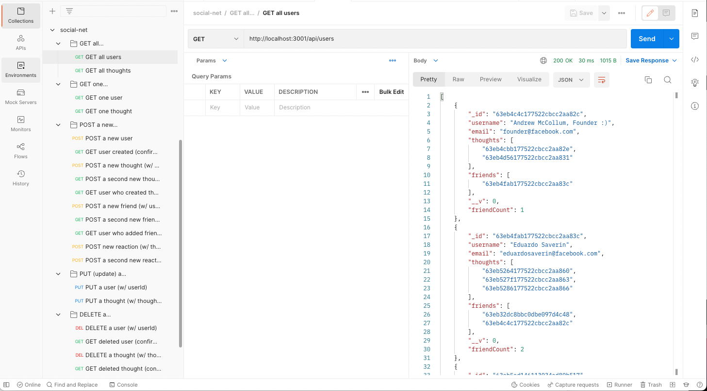

- thoughts (/api/thoughts)

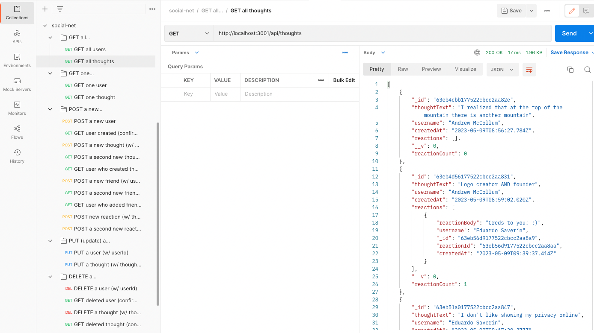


    GET a...

- single user by user's _id (/api/users/:userId)
    - populate: thought and friend data

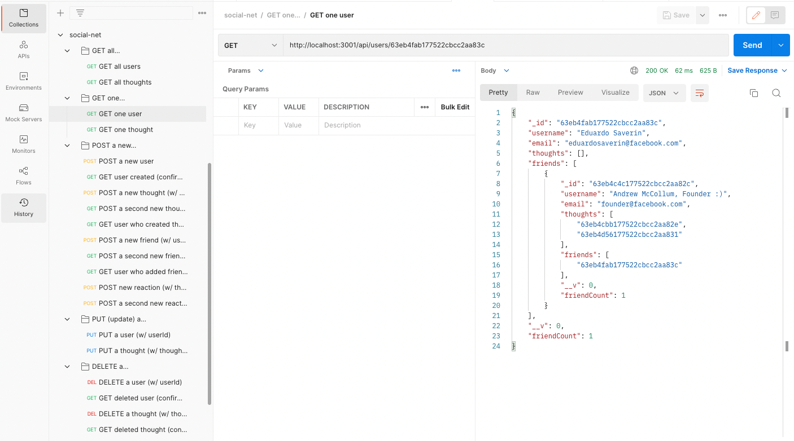

- single thought by thought's _id (/api/thoughts/:thoughtId)

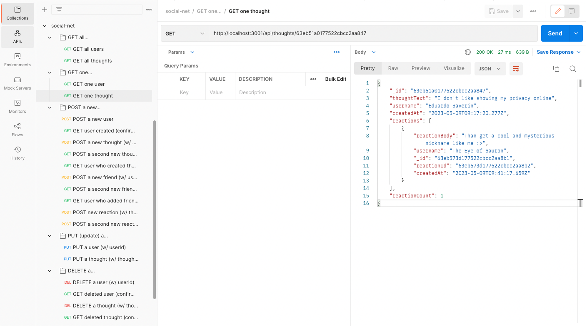

    POST (or create) a...

- new user (/api/users)
    - request body:
        1) username
        2) email

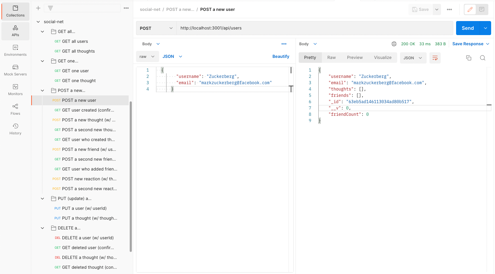

- new thought (/api/thoughts)
    - request body:
        1) thoughtText
        2) username
        3) userId (stored in associated user's thoughts array field)

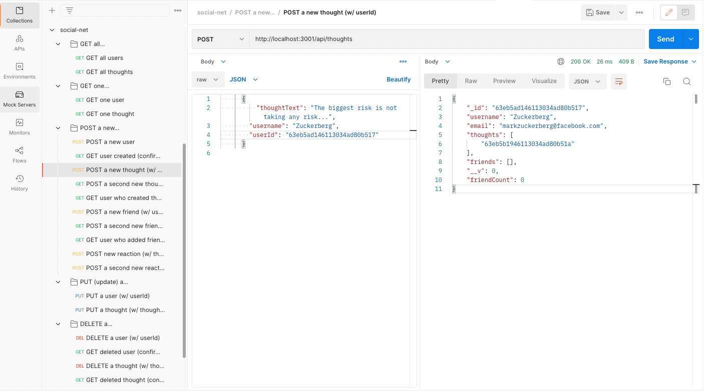

- new friend by user's _id and users' friend's _id (/api/users/:userId/friends/:friendId)
    - no request body
    - friendId = userId of friend added to user's friends list array

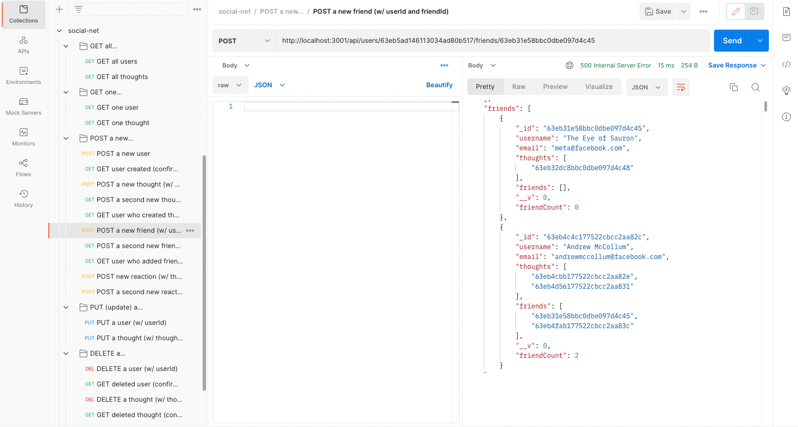

- new reaction by thought's _id (/api/thoughts/:thoughtId/reactions)
    - request body:
        1) reactionBody
        2) username
            - stored in single thought's reactions array field

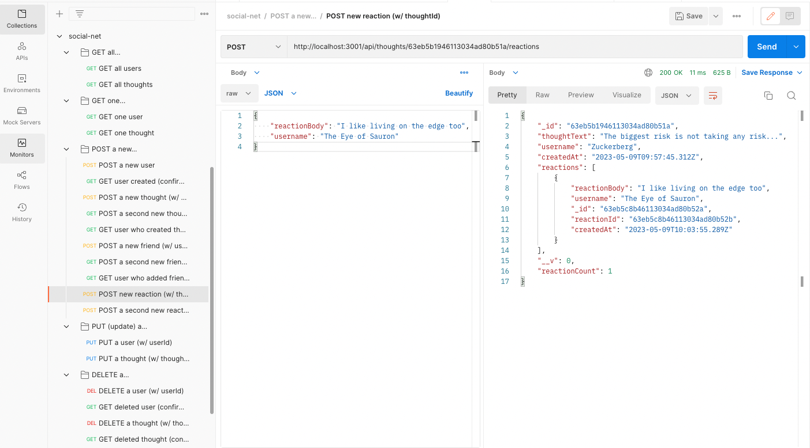


    PUT (update) an...

- existing user by user's _id (/api/users/:userId)
    - request body:
        1) username
        2) email

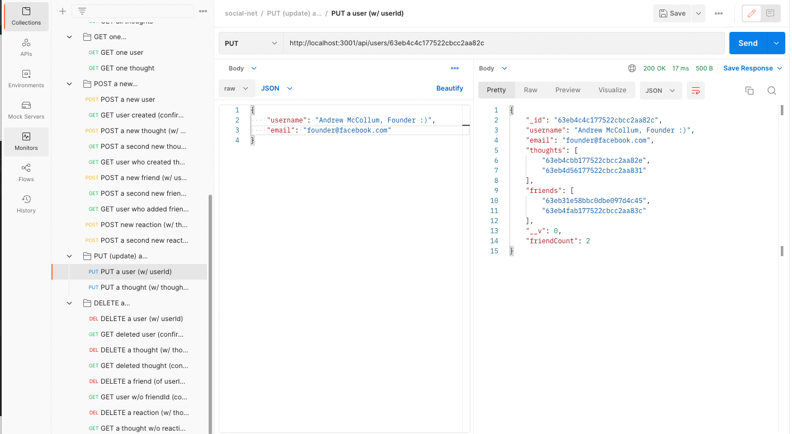


- existing thought by thought's _id (/api/thoughts/:thoughtId)
    - request body:
        1) thoughtText
        2) username

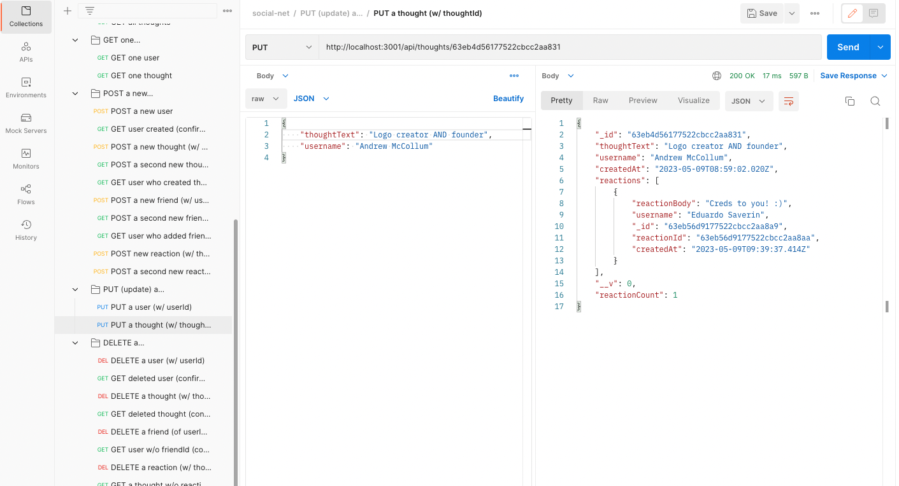


    DELETE an...


- existing user by user's _id (/api/users/:userId)
- existing thought by thought's id (/api/thoughts/:thoughtId)
- existing friend from user's friend list by user's _id and user's friend's user _id (/api/users/:userId/friends/:friendId)
- existing reaction from thought's reaction array by thought's _id (/api/thoughts/:thoughtId/reactions)


> After creating, updating, and deleting data from the `socialNetDB` in Postman (or Insomnia) dynamicaly, MongoDB also reflects the data stored and can be viewed through the MongoDB Compass tool

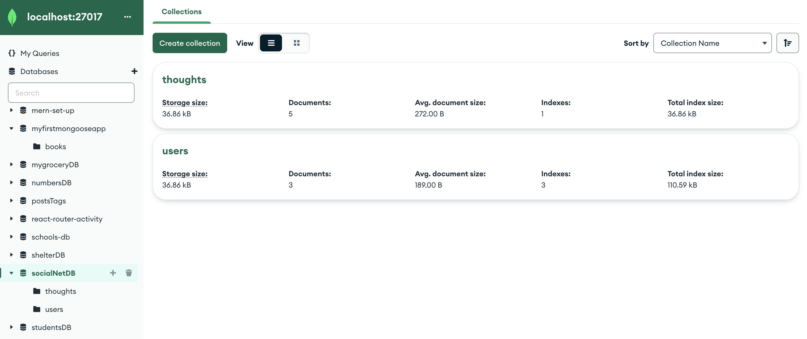


## Installation

1. To clone this project from GitHub to your local computer

> Click the Code drop-down button in this page and Copy URL for that repository:

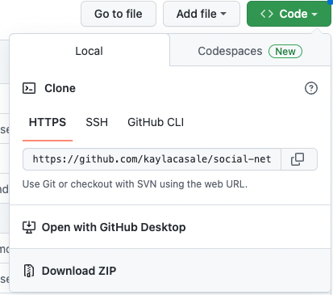

> Enter the following command in your terminal on the level of your project folder (assuming you have Git installed)

    `git clone <URL>`
    > URL = https://github.com/kaylacasale/social-net.git


2. Install neccessary packages

This application uses Express.js (via Node.js for routing), MongoDB (NoSQL database), and Mongoose (ODM) to run on the command-line.

> Enter into the terminal in your source folder

    `npm install`

OR

    `npm i`

> Alternative: install each dependency manually

    `npm i express`

    `npm i mongoose`

3. Install MongoDB locally along with Postman to manipulate data and Compass to view in database on your machine.

    >> MongoDB (https://coding-boot-camp.github.io/full-stack/mongodb/how-to-install-mongodb)

    >> Postman (https://www.postman.com/downloads/)

    >> MongoDB Compass (https://www.mongodb.com/try/download/compass)

## Usage

> To start the server and invoke the application, run the following command:

    `npm run start`

OR

    `npm start`

> To manipulate (GET, POST, PUT, DELETE) seed data dynamically and test the API protocols, use Postman or Insomnia:

    request URL starts with:   `http://localhost:3001/...`

> One Mongoose models are synched to the database upon invoking the application, view your updated `socialNetDB` database on MongoDB Compass

- User documents in socialNetDB from Compass
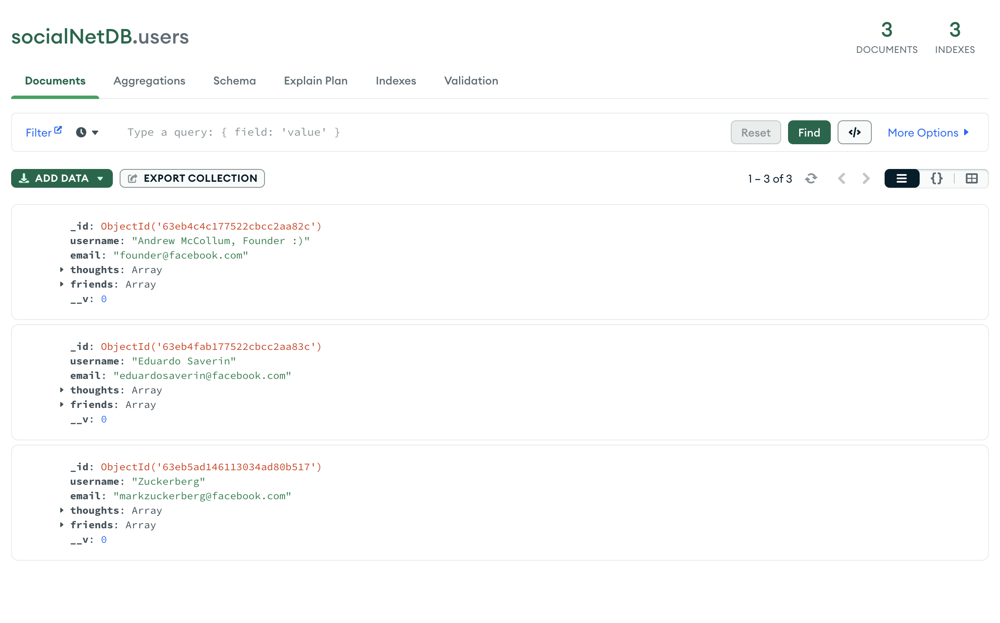
    
- Thought documents in socialNetDB from Compass
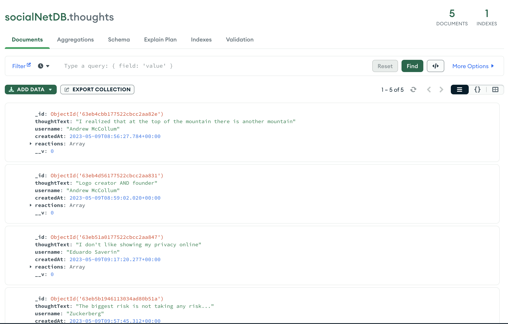


## Built With

> Javascript

> Express.js

> Node.js

> MongoDB

> Mongoose

> Postman

## Walkthrough Video
